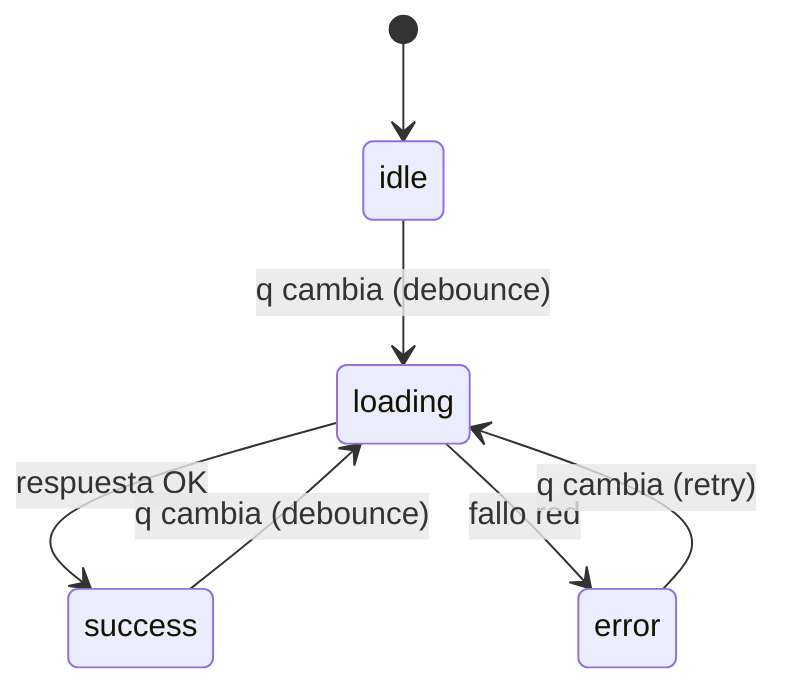
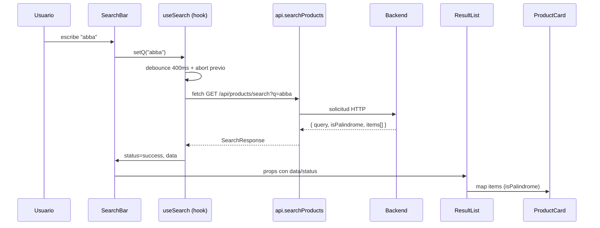
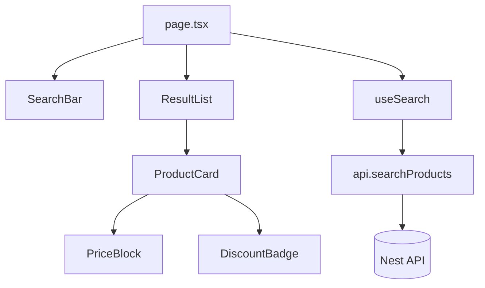

# Arquitectura Frontend — **Reto Palíndromo** (Next.js + TS + Tailwind + shadcn/ui)

> **Propósito del documento**: describir, con precisión, la **arquitectura**, **patrones** y **decisiones técnicas** del frontend para cumplir **única y exactamente** lo requerido por el reto. Sin features extra.

---

## 1) Contexto y alcance

* **Micro aplicación web** con:

  * Un **buscador**.
  * Una **sección de resultados** que consume `GET /api/products/search?q=...` del backend.
* **Regla visual**: si la respuesta indica palíndromo (`isPalindrome: true` y/o `originalPrice` en items), mostrar **50% OFF**, `originalPrice` tachado y `finalPrice` destacado.
* **No-objetivos** (excluidos deliberadamente): auth, rutas adicionales, paginación, sorting, i18n, analytics, stores globales, SSR/ISR, theming avanzado.

---

## 2) Decisiones técnicas clave (y por qué)

1. **Next.js 14 (App Router) + TypeScript estricto**

   * Proyecto pequeño ⇒ una sola ruta (`/`) y tipado robusto para el contrato de la API.
2. **CSR (Client-Side Rendering)**

   * La búsqueda depende del input del usuario; SEO no es requisito. CSR reduce complejidad (sin server actions/SSR).
3. **Tailwind CSS + shadcn/ui**

   * **Tailwind**: velocidad y consistencia visual.
   * **shadcn/ui**: componentes accesibles y minimalistas (Input, Button, Card, Badge, Skeleton, Alert).
4. **Sin estado global**

   * Flujo simple que cabe en un **custom hook** (`useSearch`) con `useState` + `AbortController`.
5. **Fetch nativo + AbortController + debounce**

   * Evitamos spam de requests y **cancelamos** llamadas en vuelo al cambiar la query.
6. **Accesibilidad AA**

   * Formulario semántico, label visible, `aria-live` en resultados, foco visible, contraste adecuado.

> **Justificación general**: máxima **claridad** y **evaluabilidad** con el mínimo de piezas necesario; arquitectura **limpia** y **cohesiva** enfocada al criterio del reto.

---

## 3) Estructura de carpetas

```
src/
  app/
    layout.tsx
    page.tsx                 # Home: SearchBar + ResultList
    globals.css
  components/
    search/
      SearchBar.tsx          # input controlado + accesible
    results/
      ResultList.tsx         # render states + aria-live
      ProductCard.tsx        # título, marca, descr., PriceBlock, DiscountBadge
      PriceBlock.tsx         # finalPrice + originalPrice (del)
      DiscountBadge.tsx      # “50% OFF”
    feedback/
      EmptyState.tsx
      ErrorState.tsx
      LoadingSkeleton.tsx
  lib/
    api.ts                   # fetch tipado + abort/timeout
    types.ts                 # SearchResponse, ProductDTO
    format.ts                # formatCurrency (Intl.NumberFormat)
    useSearch.ts             # hook con debounce + cancelación
  styles/
    tailwind.css (alias)
```

---

## 4) Módulos y responsabilidades

* **`SearchBar`**: control del input y envío; accesible (`role="search"`, label visible, helper text).
* **`useSearch`**: orquesta el ciclo de vida de la búsqueda:

  * `q`, `setQ`, `status: 'idle'|'loading'|'success'|'error'`, `data`, `error`.
  * **Debounce** (\~400 ms), `AbortController` para cancelar peticiones previas.
* **`api.searchProducts`**: cliente HTTP:

  * Construye URL con `NEXT_PUBLIC_API_BASE_URL`.
  * Headers mínimos (`Accept: application/json`).
  * `cache: 'no-store'`, timeout defensivo.
* **`ResultList`**: renderiza estados (`idle`, `loading`→Skeletons, `error`→Alert, `success`→grid o `EmptyState`).
* **`ProductCard`**: contenido semántico (`<article>`), `PriceBlock` y `DiscountBadge` si aplica.
* **`PriceBlock`**: formateo y jerarquía de precios (final > original tachado).
* **`DiscountBadge`**: visibilidad clara del 50% OFF.
* **`EmptyState` / `ErrorState` / `LoadingSkeleton`**: feedback consistente y accesible.

---

## 5) Patrones de desarrollo

* **Composición** de componentes (presentacionales) + **hook** contenedor de lógica (`useSearch`).
* **Tipado explícito** del contrato (`SearchResponse`, `ProductDTO`) para evitar ambigüedades.
* **Separación de responsabilidades**:

  * UI (components) vs **datos** (hook/api).
  * Formateo y utilidades en `lib/format.ts`.
* **Estados de UI** bien definidos (máquina simple).

### Diagrama de estados (UI)



---

## 6) Flujo de datos



---

## 7) Accesibilidad (WCAG 2.1 AA)

* **Formulario**: `role="search"`, `aria-label="Búsqueda de productos"`, `label` visible (no solo placeholder).
* **Resultados**: `aria-live="polite"` en contenedor; `aria-busy` durante `loading`.
* **Foco**: visible siempre (ring Tailwind); orden de tabulación lógico.
* **Contraste**: ≥ AA en texto y componentes.
* **Mensajes**: `ErrorState` con `role="alert"`; `EmptyState` descriptivo.
* **Teclado**: enviar con **Enter**, limpiar con **Esc** (si se implementa botón de limpiar).

---

## 8) Diseño visual (UX/UI)

* **Mobile-first**, contenedor `max-w-screen-lg`, espaciado generoso.
* **Jerarquía**: `H1` → sección de búsqueda → resultados.
* **Cards**: tipografía legible, `line-clamp` en descripción (2–3 líneas), grid responsivo (1/2/3 cols).
* **Precios**: `finalPrice` prominente; `originalPrice` con `<del>` si existe.
* **Indicadores**: `Badge` “50% OFF” cuando aplique; skeletons evitan saltos de layout.

---

## 9) Contrato de API y tipos (front)

* **Endpoint**: `GET /api/products/search?q=<string>`
* **Respuesta**:

  ```ts
  type ProductDTO = {
    id: number;
    title: string;
    brand: string;
    description: string;
    finalPrice: number;
    originalPrice?: number;
  };
  type SearchResponse = {
    query: string;
    isPalindrome: boolean;
    items: ProductDTO[];
  };
  ```
* **Reglas de render**:

  * Mostrar siempre `finalPrice`.
  * Si `originalPrice` existe → tachado + badge 50% OFF.

---

## 10) Configuración y entornos

* `.env` (front):

  * `NEXT_PUBLIC_API_BASE_URL=http://localhost:3000`
  * `PORT=3001` (definido en script `dev`).
* **CORS**: el backend debe permitir el origen del front en local.
* **Docker (web)**: imagen Next standalone; variable `NEXT_PUBLIC_API_BASE_URL` suministrada en runtime.

---

## 11) Criterios de evaluación por componente

* **SearchBar**

  * Accesible, label visible, helper text (“4+ caracteres…”).
  * Input controlado, Enter envía (si se habilita submit manual).
  * Foco visible, contraste AA.

* **ResultList**

  * `aria-live` y `aria-busy` correctos.
  * Estados **idle/loading/error/success** bien diferenciados.
  * Grid responsivo sin reflows notables (skeletons).

* **ProductCard**

  * `<article>` semántico.
  * Título/Marca/Descripción con jerarquía clara.
  * `PriceBlock` y `DiscountBadge` solo cuando corresponda.

* **PriceBlock**

  * `finalPrice` formateado (MXN); `originalPrice` con `<del>`.
  * Alineación consistente en todas las cards.

* **Feedback (Empty/Error/Loading)**

  * Mensajes breves y claros.
  * `ErrorState` con `role="alert"`.

* **Hook/API**

  * Debounce activo (\~400 ms).
  * Cancelación de request previo con `AbortController`.
  * Manejo de `timeout` y errores de red.

---

## 12) Calidad y mantenibilidad

* **ESLint + Prettier**: reglas por defecto Next.
* **Convenciones**: nombres descriptivos, componentes puros cuando sea posible.
* **Tipos**: evitar `any`; usar `SearchResponse`, `ProductDTO`.
* **Imports**: relativos desde `@/src/...` para claridad.

---

## 13) Diagramas de dependencias



---

## 14) Riesgos y mitigación

* **Cambios de contrato** del backend → tipado centralizado en `lib/types.ts`.
* **Latencia** o **errores de red** → cancelación + `ErrorState`.
* **Accesibilidad** descuidada → checklist AA incluida; test manual con teclado y Lighthouse.

---

## 15) Definition of Done (Front)

* La página `/` muestra buscador y resultados con estados `idle/loading/success/error`.
* Debounce y cancelación de requests funcionando.
* Render correcto de **50% OFF** (badge) y precios (final/original).
* Accesibilidad básica AA: label, `aria-live`, foco, contraste.
* El front corre en **3001** y consume el backend en `NEXT_PUBLIC_API_BASE_URL`.
* Docker del front builda y ejecuta correctamente.

---

## 16) Futuras mejoras (fuera de alcance, sugeridas)

* Tests unitarios de componentes clave y `useSearch`.
* CI simple (lint + build).
* Mensajería de errores refinada y telemetría básica.
* Paginación en resultados si creciera el dataset.

---

**Conclusión**: esta arquitectura privilegia **simplicidad, accesibilidad y claridad**. Es **suficiente** para cumplir el reto con alta **calidad de código** y **UX** sin agregar complejidad innecesaria.
